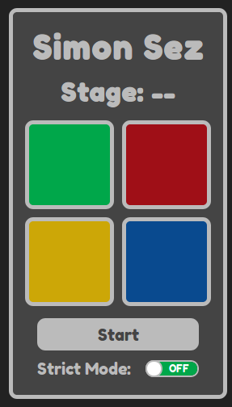

# Simon Game

Implementation of the [freeCodeCamp Simon Game project](https://www.freecodecamp.com/challenges/build-a-simon-game).

I originally made this project on Codepen months ago. This remake:

* Moves the project off of Codepen.
* Removes the dependencies on jQuery and Bootstrap.
* Uses the *How to Design Programs* method learned from [the edX course](https://www.edx.org/course/how-code-simple-data-ubcx-htc1x).
* Uses the DOM API directly, as learned from [the *DOM Enlightenment* book](http://domenlightenment.com/).
* Removes the AudioFX library, and uses the Audio API directly to play frequencies.
* Uses ES2015.
* Uses Jest for unit tests.
* Fixes timing issues.
* Fixes issues with game play on mobile.

The game is at [http://www.toddhancock.net/simon-game/](http://www.toddhancock.net/simon-game/).

Here's the link to the [original Codepen version](https://codepen.io/thancock20/pen/NxKrWZ) for comparision.
